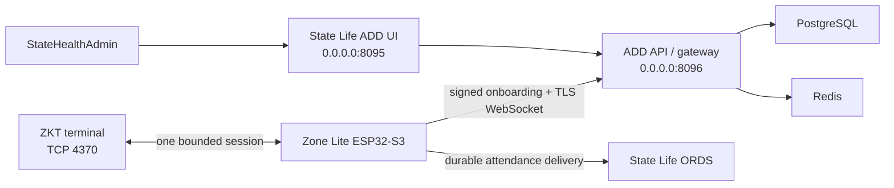

# Attendance Device Dashboard architecture

## System boundary

ADD is State Life's command, control, and surveillance center for Zone Lite ESP32–ZKT pairs across
Pakistan. Zone Lite owns all terminal protocol traffic. The connector opens outbound TLS to ADD;
the control plane never requires an inbound branch firewall rule and the browser never receives a
ZKT Comm Key or terminal OS credential.

PostgreSQL is authoritative for connectors, encrypted identity metadata, attendance, commands,
leases, telemetry, alerts, sessions, and the hash-chained audit ledger. Redis is private and
reserved for realtime fan-out/rate limiting. One API worker owns connector WebSockets until a
distributed ownership adapter is introduced.

## Automatic connector lifecycle

1. Secure provisioning derives a unique bootstrap secret from the fleet root and ESP Wi-Fi MAC.
2. The ESP posts its MAC, timestamp, nonce, body hash, and HMAC signature to `/device/v2/onboard`.
3. ADD validates clock skew, consumes the nonce once, deterministically resolves the connector,
   rotates its device token, and returns the public WebSocket URL.
4. The previous token remains valid for a bounded overlap so a power loss between NVS write and
   reconnect cannot strand the connector.
5. The ESP saves the connector ID/token in encrypted NVS and opens the outbound device stream.
6. Heartbeats, logs, terminal state, time samples, users, punches, and command results keep ADD in
   live sync. No operator registration or activation code exists.

Each authenticated request is bound to the connector ID, timestamp, one-use nonce, body SHA-256,
and connector token. Replay, stale timestamp, wrong MAC, or wrong signature fails before any state
mutation.

## Terminal identity and write certification

The ESP reports serial, model/platform, firmware, MAC, user-record size, observations, and snapshot
completeness. ADD certifies a write profile only after stable observations:

- 72-byte record + complete snapshot: user writes may be enabled.
- 28-byte record: read-only because the eight-byte name cannot preserve the required identity
  representation.
- Unknown/truncated/partial record: read-only.
- One serial claimed by multiple active connectors: every claimant is quarantined; user mutations
  and restart commands fail closed until the physical mapping is resolved.

The certification fingerprint changes when terminal identity/profile changes. A change clears
write certification until fresh stable observations arrive.

Per-user command preconditions are independent of the certification fingerprint. Zone Lite 2.1.2
adds keyed raw-record fingerprints so records from older terminals remain safely editable even when
their user-ID bytes cannot be represented losslessly in JSON. Until a refreshed snapshot supplies
those fingerprints, ADD refuses to queue a mutation for a visibly sanitized legacy ID.

## User lifecycle

Users are always scoped to the selected terminal and have a stable ADD UUID independent of mutable
ZKT UID/user-ID fields. The dashboard supports:

- search by masked CNIC, employee/device ID, or name;
- create with employee ID, full name, CNIC, and shift-worker flag;
- edit missing or existing name/CNIC/shift fields;
- display current role and grant the bounded administrator lease;
- delete the ZKT identity without deleting punches.

The exact byte-limited ZKT name preview is shown before a write. CNIC is accepted as thirteen digits,
stored encrypted, indexed with a keyed lookup hash, returned only masked, and never placed in logs.
The mask exposes only the final four digits. Duplicate detection always compares the keyed digest of
all thirteen normalized digits; it never compares masks. When a complete terminal snapshot contains
an exact duplicate, ADD shows the number of affected groups and the matching ZKT user IDs. Create and
update requests remain available for other unique CNICs, while reuse of the conflicting CNIC is
blocked with the exact terminal record that currently claims it.

Some older terminals contain multiple user records for the same employee. ADD handles that case
without merging or deleting terminal data. The Identity Review view shows the exact group, masked
CNIC, names, UID/user IDs, current ADD punch evidence, and the fraction of terminal history actually
present in ADD. After independent verification, a password step-up and typed confirmation create an
audited `SAME_EMPLOYEE_MULTIPLE_TERMINAL_RECORDS` resolution. The user rows, templates, UID/user IDs,
and existing attendance remain byte-for-byte untouched; future punches retain their originating
terminal record and carry the resolution ID as provenance. A resolution can be revoked, and it
automatically becomes stale if a later complete ZKT snapshot changes group membership. Mixed-name
groups stay quarantined until HR confirms a same-employee relationship or corrects the wrong CNIC.
Every mutation has an idempotency key, expected row version, expected terminal identity, encrypted
desired state, expiry, and immutable audit record.

### Delete invariant

Delete uses only ZKT `CMD_DELETE_USER` after a fresh terminal read proves the expected serial,
user-ID, UID, name, privilege, and version. The ESP writes a minimal encrypted tombstone before the
delete, executes the command, rereads the user table, and verifies the identity is absent. It also
reads the attendance count before and after; any count change makes the command fail. ADD retains
all attendance and a masked tombstone, marks the user deleted, and never reuses that row as a new
identity.

## Ten-minute enrollment administrator lease

The operator selects a device and existing user, enters the ADD password again, and requests a
ten-minute lease. ADD and the ESP both enforce the deadline.

1. ADD verifies the recent password step-up and that the device profile is writable.
2. A fresh ESP read proves the user is present and regular privilege `0`.
3. The ESP writes administrator privilege `14`, rereads it, persists the absolute revocation epoch
   in encrypted NVS, and reports success.
4. Manual newcomer enrollment is performed on the ZKT screen during the window.
5. At expiry, the local watchdog writes privilege `0` even if ADD or the internet is unavailable.
6. If the ZKT is offline, the revoke remains durable and retried without rapid reconnects; ADD shows
   an overdue high-severity alert until a verified reread proves privilege `0`.

Scheduled and operator restarts are blocked during an active lease. Re-requesting the same command
cannot extend the deadline unless a new, separately authorized lease is created.

## Connection lifecycle and intermittent terminals

Terminal health is independent from ESP health. A connected ESP may report `DISCOVERING`,
`SUSPECT`, `RETRY_WAIT`, `FLAPPING`, `RECOVERING`, or `ONLINE` for its ZKT.

- The last authenticated IP is attempted directly; a successful connection becomes the live
  session rather than being discarded after a probe.
- Authentication, live registration, command work, and reconcile use one serialized terminal
  owner. Every exit path unregisters events, sends protocol exit when safe, closes the socket, and
  releases the owner.
- A single failure does not declare a terminal offline. Backoff is exponential and bounded with
  jitter. Repeated up/down transitions enter a five-minute quiet period.
- Full subnet discovery is no more frequent than every fifteen minutes. A preferred IP of `0.0.0.0`
  means safe DHCP discovery, not continuous scanning.
- After recovery, live event capture is restored first. Three healthy observations and a two-minute
  stable session are required before reconciliation or write capability resumes.
- Recovery may restart a confirmed stuck terminal only after the configured failure threshold and
  thirty-minute cooldown. It never reboots the ESP because the terminal is unavailable.

This state machine specifically treats older ZKT models that appear briefly, disappear, and return
as expected degraded equipment rather than a reason to hammer TCP `4370`.

## Attendance reliability and reconcile

The live socket registers attendance events and immediately appends each accepted event to durable
flash. HTTP/WebSocket delivery runs on separate tasks, so slow internet cannot block the ZKT receive
loop. ADD and ORDS acknowledgements advance independent outboxes.

Every fifteen minutes, the connector compares count deltas against live punches already captured.
A matching delta is a light reconcile. A mismatch, counter reset, first boot, or six-hour truth
deadline requests a bounded table read. Live capture remains higher priority and resumes before a
large truth operation. The encrypted-NVS count and truth checkpoint survives reconnects and ESP
restarts, so an intermittent older terminal does not repeatedly trigger a full-history read. Event
IDs are deterministic, making backend/ORDS retries idempotent.

Malformed historical rows are isolated rather than blocking newer punches. Flash queues are
bounded, checksummed, replayed after restart, and removed only after application-level acknowledgement.

## Restart policy and time

SNTP establishes ESP time. The terminal time, sampling time, drift, and next scheduled restart are
visible live in ADD. Preventive ZKT restarts are enabled at 02:00, 12:00, and 22:00 Pakistan time.
Each slot is persisted so an ESP reboot cannot repeat it. An authenticated ZKT protocol restart is
preferred; the confirmed telnet path is a cooldown-protected fallback. Active leases defer restart.

The operator can request a restart from ADD with password step-up. The command is idempotent,
expires, and remains observable through queued, waiting, running, retrying, succeeded, failed,
cancel-requested, cancelled, and expired states.

## Dashboard behavior

The responsive dashboard has Fleet, Users, Attendance, and Alerts workspaces plus a live device
drawer. It uses the supplied State Life mark and only State Life blue `#0094DA`, white, and neutral
tones. Error/warning/success meaning is reinforced with labels, icons, and patterns rather than
red/amber/green theme colors.

The UI includes keyboard focus management, visible focus, reduced-motion handling, masked PII,
mobile layouts, explicit empty/loading/error states, and no registration option. Server-sent browser
events update fleet status and logs while bounded polling provides recovery if an event stream drops.

## Data retention

- Attendance: immutable; no user-delete cascade.
- Audit ledger: hash chained; mutation details recursively redacted.
- Device logs: 14 days by default.
- Telemetry: 30 days by default.
- Admin sessions: 90 days maximum retention; normal sessions expire earlier.
- Connector nonces and expired credentials: pruned by maintenance.

Production backup, rollback, incident response, and post-deploy observation are defined in
[production-runbook.md](production-runbook.md). Hardware proof is defined in
[hardware-acceptance.md](hardware-acceptance.md).
